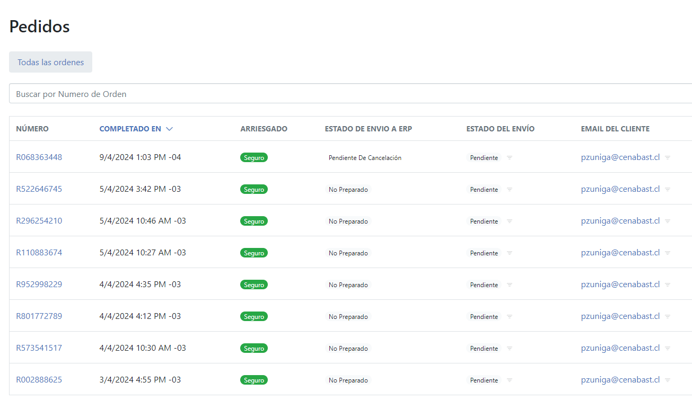

# Overview

:::info
This doc explains how Spree interacts with Cenabast ERP, in the lifecycle of an Spree::Order
:::

## Implementation

When an Spree::Order finishes the checkout process, it will get into state complete.
This will trigger a series of callbacks, one of those being the submission to the ERP.

Using the `#inject_to_erp!` method, the order will be grouped in respective SaleOrders
each SaleOrder represents a division of LineItems which will be sent to the ERP.
This is currently being set to split the LineItems based on its vendor, grouping all the products associated of one vendor into a SaleOrder

Then, for every created SaleOrder, a background job will be scheduled to run the sending of that order.
The job SendSaleOrderToErp its, used. Under its hood it calls the respective API endpoint for injecting the SaleOrder information (/interoperabilidad/tienda/api/v1/pedido), and a service dedicated to storing the success/failure information into the SaleOrder model.

### SaleOrders statuses

Each SaleOrder model will have an associated status, that will indicate its status withing the ERP:

* `initial`
  Base status that is set when the SaleOrder is recently created

* `sent`
  SaleOrder has been sent to the ERP successfully

* `failed`
  There was an attempt to send the SaleOrder to the ERP, but the response wasnt successful.

* `nullified`
  SaleOrder has been nullified in the ERP successfully

* `cancellation_pending`
  SaleOrder has been requested to be nullified, and has a nullified job in progress

### See information about SaleOrders

In the admin panel, admin users can see information about the stablished SaleOrders, and its respective statuses.

When viewing a respective Spree::Order, go to the "ERP Pedidos de Venta" tab.

From there, admins can see the status of sale orders, its saved information from the erp, and which line items are contained by each SaleOrder.

### Cancellation/Nullification of a SaleOrder

SaleOrders that are in status "sent", and be nullified by using the "Cancelar pedido de venta" option.

This will trigger a cancelation background job, similar to the one used in the creation/injection of the sale order in the ERP.
