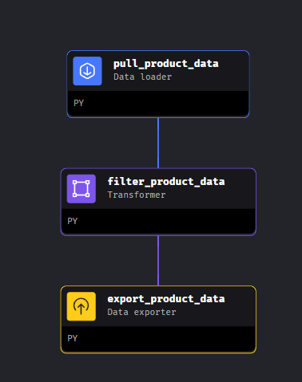
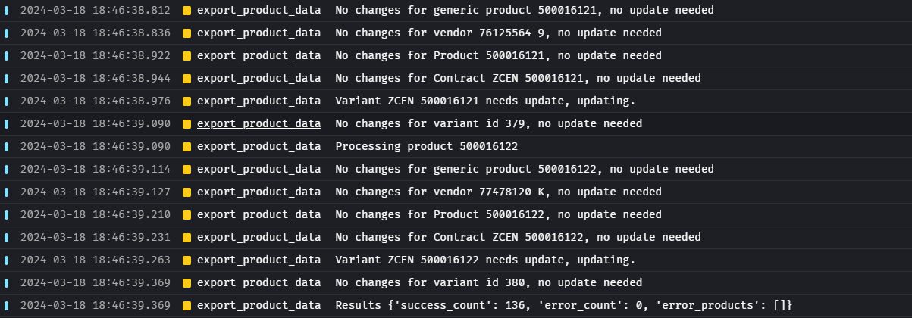
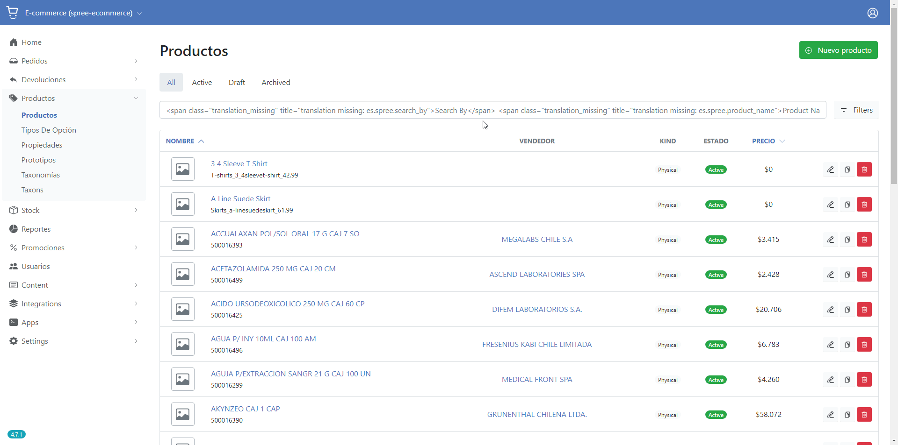
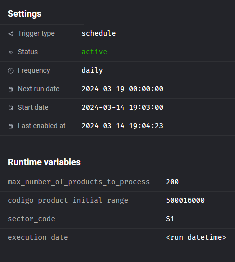

# Overview

:::info
This doc explains how scheduled product sync (bringing information from Cenabast) to Spree works
:::

See also:
* [MageAI Documentation](mage.ai)
* [MageAI](mage-ai.md)
* [API tienda V2](/cenabast-tienda/docs/api-rest-services/Cenabast/tienda)

## Implementation

MageAI is used for the periodic data extraction and load into Spree, using APIs:

A Data Pipeline was created for the product sync. The pipeline its scheduled to run every day.

A python client was created to interact with the Spree API and split into resources. Each REST resource has its own client and associated functions.

The product sync data pipeline workflow can be split onto three components:



### 1 - Data importer

**In charge of contacting Cenabast APIs.**

* First, it will request a token (/interoperabilidad/tienda/api/v1/auth)
* Then make an scoped query to the catalog materials endpoint, obtaining information of ZGEN products existing in cenabast (/interoperabilidad/tienda/api/v1/auth)
  * The specific query params used will depend if its an massive product synchronization, or an individual one.
  * The pipeline parameters used to control that will be described later in this document
* For each ZCEN obtained, it will try to obtain its contracts using the contract endpoint (/interoperabilidad/servicios/api/v1/materiales/contratos/`<zgen_code>`)
* Each ZGEN product with its given contracts is sent to the next step of the pipeline

### 2 - Transformer

**In charge of filtering and manipulating the entry data**

* For each ZGEN product, it will check if it at least one valid contract
* Valid contracts are ones that have a current date. Meaning the start date has already passed (contract already running), and the end date hasnt yet elapsed (contract hasnt expired)
* ZGEN products are filtered considering that logic
* The remaining valid entries are sent to the next step of the pipeline

### 3 - Data exporter

**In charge of loading data into Spree**

Data is loaded onto Spree using Api v2 platform endpoints.

In broader terms, the loading strategy used was to create entities, and update those with new data if any changes are perceived.

Information about the general (non decorated, non customized) Spree Api V2 endpoint collections can be found on the [Spree API Documentation](https://api.spreecommerce.org/docs/api-v2/0e192836641aa-platform-api).

:::info
**Postman collection with actual endpoints used:**

[Postman collection](./product-sync/spree-api-v2-plaftorm-examples.postman_collection.json)
:::

To autenticate and use the endpoints of the API, it is necesary to create an oAuth Application inside the Spree Admin backoffice:
https://dev-docs.spreecommerce.org/api/platform-api/authenticating-requests

The application created must have the scope `admin` associated.

The generated Client ID and client secret must be stored, and exposed through the correspondint env variables to the MageAI process:

```
SPREE_CLIENT_ID
SPREE_CLIENT_SECRET
```

* First, it will request a token (/spree_oauth/token) using the forementioned client_id/client_secret credentials.
* It will obtain general information about the Spree environment, this information will be used to create/update other records in the process.
  * Data from Spree Stores (/api/v2/platform/stores)
  * Data from parent Taxons (/api/v2/platform/taxons)
  * Data from Product properties (/api/v2/platform/properties)
* For each filtered ZGEN product with its corresponding contracts:
  * It will try to create/update the ZGEN contract data (/api/v2/platform/generic_products)
  * For each product contract:
    * It will try to create/update the Vendor data (/api/v2/platform/vendors)
    * Using the corresponding vendor and other information, it will try to create/update the Product data (/api/v2/platform/products)
    * Using the corresponding product and other information, it will try to create/update the Contract data (/api/v2/platform/contracts)
    * Using the corresponding product and other information, It will try to update the Product's master variant data (/api/v2/platform/variants)
    * Using the corresponding master variant and other information, It will try to update the Variant stock item information (/api/v2/platform/stock_items, /api/v2/platform/stock_locations)
* Synchronization results for each product are stored and sumarized, those stats are returned as the pipeline exit:
  * Succesful count of ZGEN products syncronized
  * Error count of ZGEN products syncronized
  * SKUs of ZGEN products with errors on syncronization



More information about the pipeline excecution can be found in the logs section of the MageAI Dashboard:

`/pipelines/product_data_pipeline/logs`

### Pipeline variables

These are the variables that the pipeline uses to parametrize its behaviour.

They can be configured per trigger basis as **Runtime variables**.

* codigo_product_initial_range
  * (Integer) Limits the minimum value of the SKU code to use for processing ZGEN products, inclusive
  * Default: None (not set)

* codigo_product_final_range
  * (Integer) Limits the maximum value of the SKU code to use for processing ZGEN products, inclusive
  * Default: None (not set)

* max_number_of_products_to_process
  * (Integer) Limits the number of products to process to a maximum, skipping the rest of the records.
  * Default: None (not set)

* product_code
  * (Integer) Defines an specific product SKU code to process, this value will be used to call the `/materiales/listacatalogo` endpoint (parameter `codigoProducto`). Enabling this will switch to individual record processing.
  * Default: None (not set)

* group_article
  * (String) Defines an specific product group to process, this value will be used to call the `/materiales/listacatalogo` endpoint (parameter `grupoArticulo`)
  * Default: None (not set)

* sector_code
  * (String) Defines an specific product sector code to process, this value will be used to call the `/materiales/listacatalogo` endpoint (parameter `codigoSector`)
  * Default: None (not set)

* page_size
  * (Integer) Defines an specific page size to use upon Cenabast product fetch, this value will be used to call the `/materiales/listacatalogo` endpoint (parameter `PageSize`)
  * Default: 5_000_000

* page_size
  * (Integer) Defines an specific page number to use upon Cenabast product fetch, this value will be used to call the `/materiales/listacatalogo` endpoint (parameter `PageNumber`)
  * Default: None (not set)

### Product attributes that are not managed by the Pipeline
(as of 2024-03-18)

The pipeline tries to store the most possible of the generic product and contract information, and create associated Spree records to work around them and enable to buy them.

However, there are some attributes required for Spree that are not given by the Cenabast endpoints, or we lack of a formal definition in order on how to load those automatically:

* Product images
* Product taxonomies (Categorization of products)
* Product description
* Product meta-tags
* Product stock

Those attributes can be managed by the Spree admin panel, in the Products section (/admin/products).

:warning: Requires to be accesed by an admin enabled user.



### Triggers

A trigger of type scheduled was created to handle the daily scheduled syncronization of records.
When configuring a trigger, a set of pipeline configuration parameters can be given:



More triggers can be created with different options.

* An API trigger can be created to expose a webhook that will trigger the pipeline execution
* When calling the API endpoint, pipeline parameters can be sent in the payload, allowing us to handle individual syncronization, or another scoped sincronization process:
  * https://docs.mage.ai/orchestration/triggers/trigger-pipeline-api

### Important environment variables

* CENABAST_API_BASE_URL
    * Root URL to use for Cenabast API

* CENABAST_API_BASE_PATH
    * Base path that points to the root of the API to use

* CENABAST_API_USER
    * API User to obtain a token from

* CENABAST_API_PASSWORD
    * Password of the API user

* SPREE_API_BASE_URL
    * Root URL to use Spree API

* SPREE_CLIENT_ID
    * Spree Client ID to use for API authentication

* SPREE_CLIENT_SECRET
    * Spree Client ID to use for API authentication
