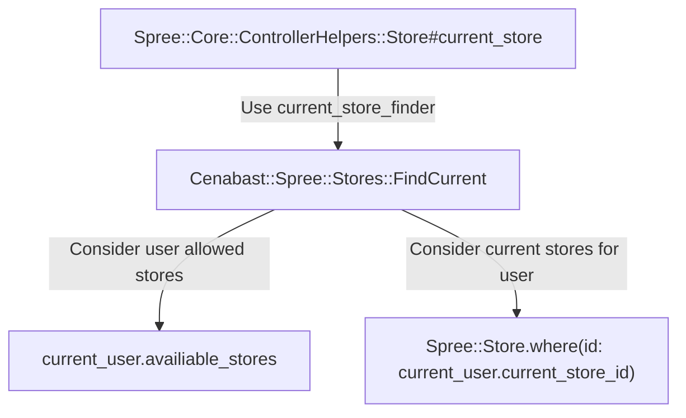

# Overview

:::info
This doc explains how the implementation of Sale Channels (ie. eCommerce, Intermediación) was done in the Spree Cenabast project.
:::

See also: [Sale Channel definition, explanation of business logic](/cenabast-tienda/docs/Store%20Project/functionalities/channels)

Each Sale Channel was represented by a [Spree::Store](https://dev-docs.spreecommerce.org/internals/stores).

A Spree::Store is associated with a set of products, enabled payment methods, layout configuration and other preferences.
In that way, it's well suited to represent the differences between each Sale Channel.

## Implementation

The `current_store_finder` dependancy was modified to use a custom finder class. The original finder detects the Store based on the URL. Our Store Finder will work based on the current user preferences.

Each user now has a `current_store` and a set of `availiable_stores`. The user is able to switch between stores amongst its enabled ones (only the `availiable_stores`). The behaviour of toggling, setting and reading the current store was defined using a concern (`Cenabast::Spree::User::StorePreference`).

Admin users by default have all the stores enabled.

A controller `Cenabast::Spree::UserPreferencesController` was defined in order to allow users to toggle their preferences (store, etc), from the frontend.

The store toggle logic can be interated from the frontend via a dropdown menu present in the header.

### Current Store find logic

