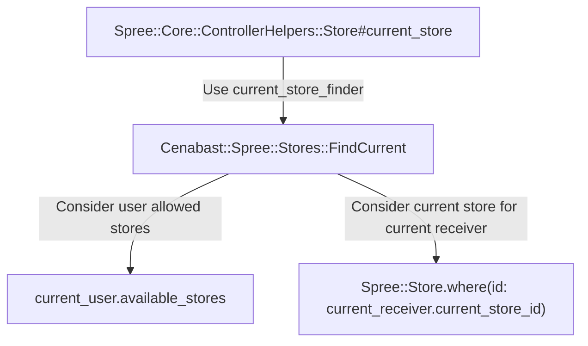

# Overview

:::info
This doc explains how the implementation of Sale Channels (ie. eCommerce, Intermediación) was done in the Spree Cenabast project.
:::

See also: [Sale Channel definition, explanation of business logic](/cenabast-tienda/docs/Store%20Project/functionalities/channels)

Each Sale Channel was represented by a [Spree::Store](https://dev-docs.spreecommerce.org/internals/stores).

A Spree::Store is associated with a set of products, enabled payment methods, layout configuration and other preferences.
In that way, it's well suited to represent the differences between each Sale Channel.

## Implementation

The `current_store_finder` dependancy was modified to use a custom finder class. The original finder detects the Store based on the URL. Our Store Finder will work based on the current user preferences.

Each user will have a list of `Recievers` that is authorized to request to buy from. Each `Cenabast::Spree::Receiver` is associated with a requester `Cenabast::Spree::Requester` (Organismo Solicitante) and a sale channel `Spree::Store` (Canal de venta).

The user amongst its store preferences will be able to switch between requesters receivers and stores amongst its enabled ones.

* For Requesters, the enabled ones are all the requesters associated to the user
* For Receivers, the enabled ones are all the receivers that belong to the requester, AND are also associated to the user
* For Stores, the enabled ones are all the stores that match the any Receiver that has the current receiver RUN, and also belong to the current available receivers (ie. all the receivers with the same RUN of the current one. That belong to the same requester, and the user has also permission to use that receiver)

Admin users by default have access to all the Requesters. and all the Receivers from that current Requester.

Details of the switch logic, relationships and other available related methods can be found in the `Cenabast::Spree::User::StorePreference` concern.

A controller `Cenabast::Spree::UserPreferencesController` was defined in order to allow users to toggle their preferences (requester, receiver, store, etc), from the frontend.

The store toggle logic can be interated from the frontend via a dropdown menus present in the header.

Then, the `current_store` for the user will be defined the store that the `current_receiver` belongs to.

### Current Store find logic

