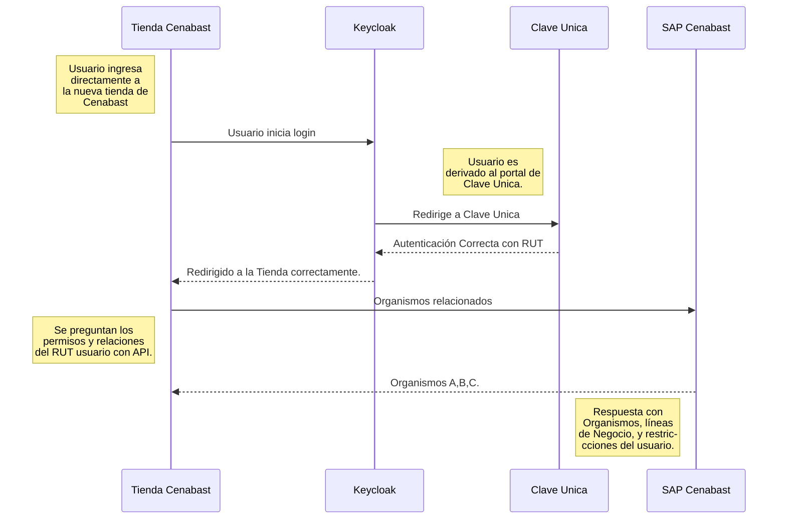
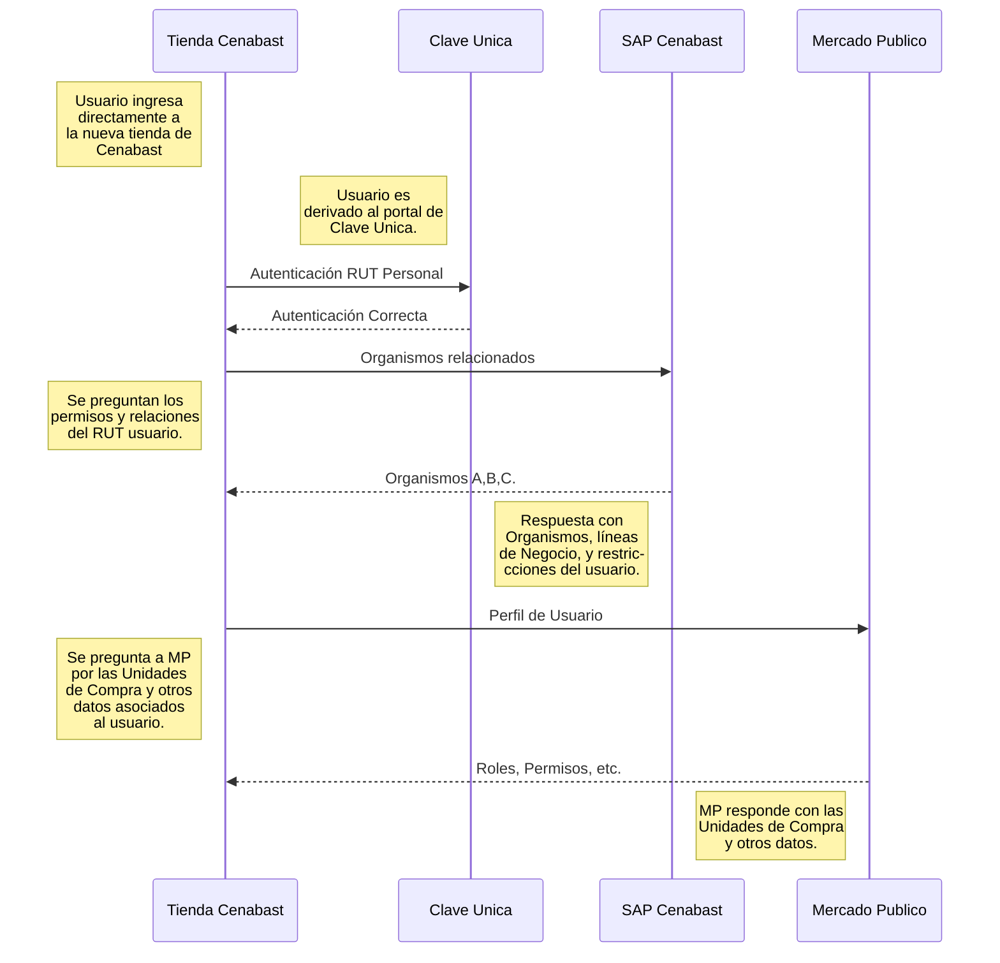

# Buyer Login Flow

:::tip
Autorización via **Clave Única** Usuario
:::

# Piloto

:::tip
Login with Clave Unica should be implemented through a Single Sign On solution. In this case, Keycloak.

👉 [Kecloak Setup](../../infrastructure/applications/Keycloak)\
👉 [Clave Unica](../../infrastructure/clave_unica)
:::

# Deseable

# Deseable

:::danger
Outdated...
:::

