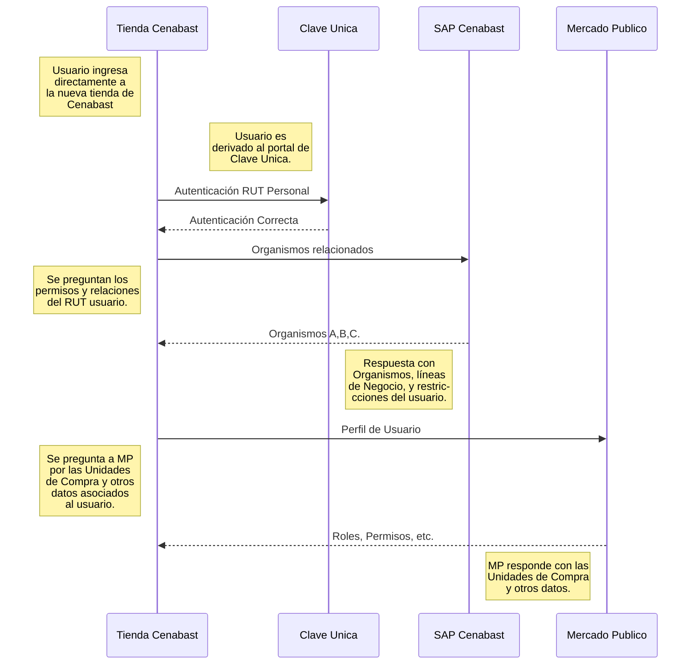
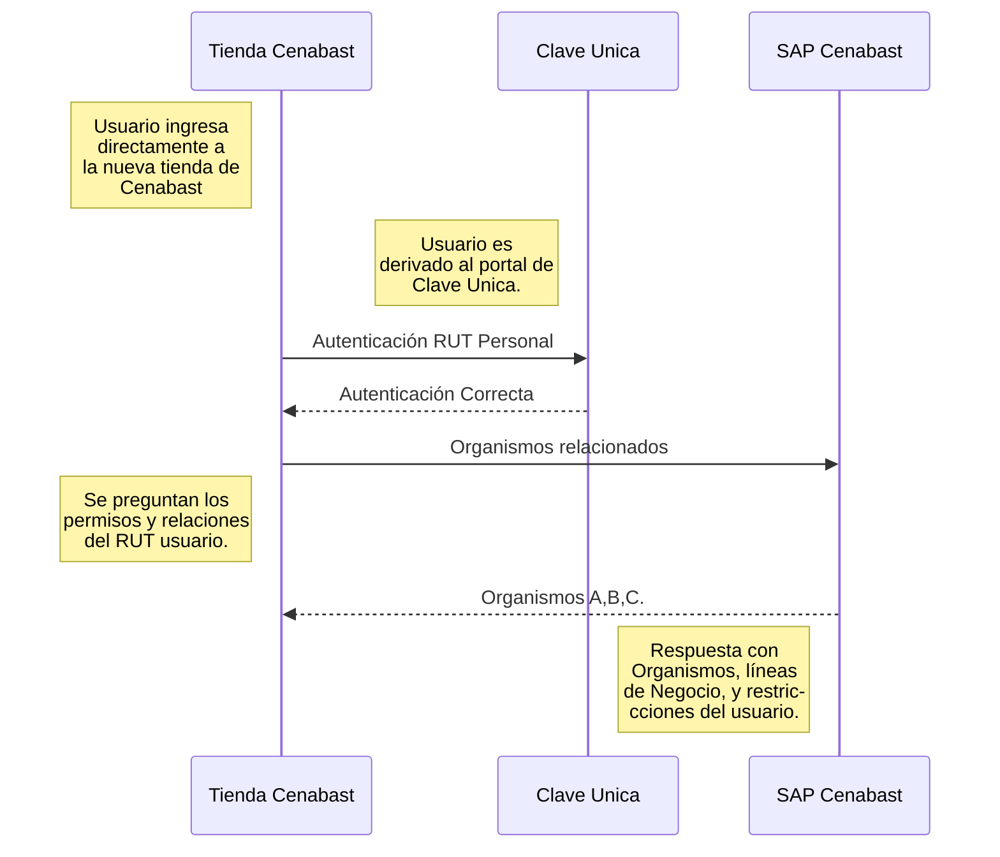

# Buyer Login Flow

:::tip
Autorización via **Clave Única** Usuario
:::

# Deseable

```mermaid
sequenceDiagram
     Note left of Tienda Cenabast: Usuario ingresa<br>directamente a<br> la nueva tienda de<br>Cenabast
     Note left of Clave Unica: Usuario es<br>derivado al portal de<br>Clave Unica.
     Tienda Cenabast ->> Clave Unica: Autenticación RUT Personal
     Clave Unica -->> Tienda Cenabast: Autenticación Correcta
     Tienda Cenabast ->> SAP Cenabast: Organismos relacionados
     Note left of Tienda Cenabast: Se preguntan los<br>permisos y relaciones<br>del RUT usuario.
     SAP Cenabast -->> Tienda Cenabast: Organismos A,B,C.
     Note left of SAP Cenabast: Respuesta con<br>Organismos, líneas<br>de Negocio, y restric-<br>cciones del usuario.
     Tienda Cenabast ->> Mercado Publico: Perfil de Usuario
     Note left of Tienda Cenabast: Se pregunta a MP<br>por las Unidades<br>de Compra y otros<br> datos asociados<br>al usuario.
     Mercado Publico -->> Tienda Cenabast: Roles, Permisos, etc.
     Note left of Mercado Publico: MP responde con las<br>Unidades de Compra<br>y otros datos.
```

# Piloto

```mermaid
sequenceDiagram
     Note left of Tienda Cenabast: Usuario ingresa<br>directamente a<br> la nueva tienda de<br>Cenabast
     Note left of Clave Unica: Usuario es<br>derivado al portal de<br>Clave Unica.
     Tienda Cenabast ->> Clave Unica: Autenticación RUT Personal
     Clave Unica -->> Tienda Cenabast: Autenticación Correcta
     Tienda Cenabast ->> SAP Cenabast: Organismos relacionados
     Note left of Tienda Cenabast: Se preguntan los<br>permisos y relaciones<br>del RUT usuario.
     SAP Cenabast -->> Tienda Cenabast: Organismos A,B,C.
     Note left of SAP Cenabast: Respuesta con<br>Organismos, líneas<br>de Negocio, y restric-<br>cciones del usuario.
```